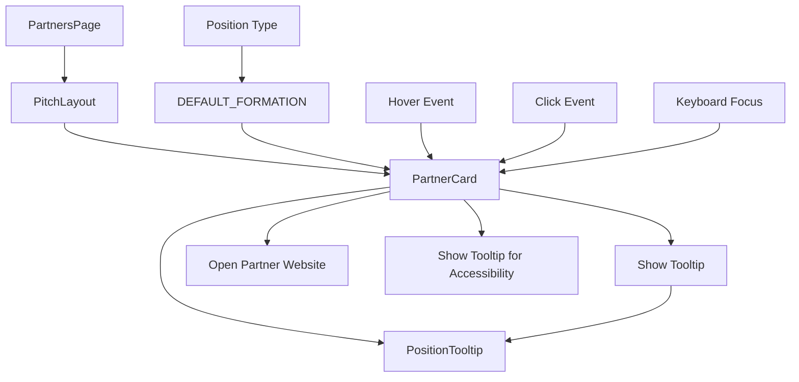
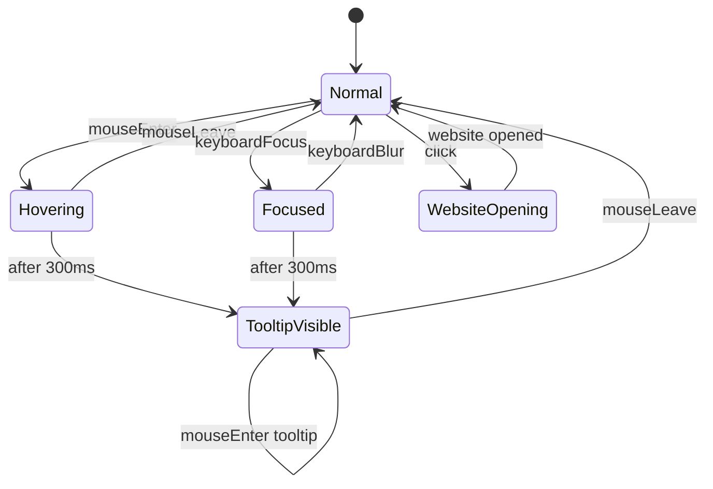
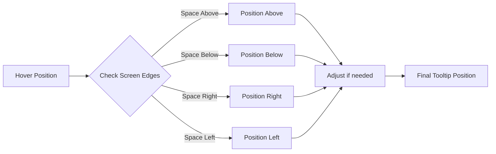

# 4-4-2 Formation Tooltip Architecture

## Component Hierarchy

```
PartnersPage
├── PitchLayout
│   ├── PitchBackground
│   └── PartnerCard (for each position)
│       ├── PositionTooltip (on hover)
│       └── Partner content
└── Other page content
```

## Data Flow



## State Management



## Position Descriptions for 4-4-2 Formation

### Goalkeeper (GK)
- **Role**: Security & Reliability Partner
- **Description**: Partners providing foundational security, reliability, and trust infrastructure for the platform. This includes payment processors, security providers, and compliance partners.

### Defenders
- **Left Back (LB)**: Content Distribution Partner
- **Centre Back 1 (CB1)**: Technology Infrastructure Partner  
- **Centre Back 2 (CB2)**: Data Analytics Partner
- **Right Back (RB)**: Customer Support Partner

**Description**: Defensive partners provide the stable foundation for our platform, ensuring reliable content delivery, robust infrastructure, insightful analytics, and excellent customer support.

### Midfielders
- **Left Midfielder (LM)**: Social Media Partner
- **Central Midfielder 1 (CM1)**: Marketing Partner
- **Central Midfielder 2 (CM2)**: Community Engagement Partner
- **Right Midfielder (RM)**: Content Creation Partner

**Description**: Midfield partners connect us with our audience through social media, marketing campaigns, community building, and compelling content creation.

### Forwards
- **Striker 1 (ST1)**: Growth & Expansion Partner
- **Striker 2 (ST2)**: Innovation & Technology Partner

**Description**: Forward partners drive growth and innovation, helping us expand into new markets and implement cutting-edge technologies for the ultimate African football experience.

## Tooltip Positioning Logic



## Responsive Behavior

- **Desktop (1024px+)**: Full tooltip with detailed descriptions
- **Tablet (768px-1023px)**: Medium-sized tooltip with essential information
- **Mobile (<768px)**: Simplified tooltip or disabled hover behavior

## Accessibility Features

1. **Screen Reader Support**
   - Tooltip content announced when position receives focus
   - Proper ARIA labels and descriptions

2. **Keyboard Navigation**
   - Tooltip appears on focus with keyboard
   - Escape key closes tooltip
   - Tab navigation between positions

3. **Visual Accessibility**
   - High contrast text
   - Sufficient color contrast ratios
   - Clear focus indicators

## Performance Considerations

1. **Event Handling**
   - Debounced hover events (300ms delay)
   - Efficient mouse leave detection
   - Proper event cleanup

2. **Rendering**
   - CSS transforms for smooth animations
   - GPU-accelerated transitions
   - Minimal reflows/repaints

3. **Memory**
   - Single tooltip instance reused
   - Proper cleanup on unmount
   - No memory leaks